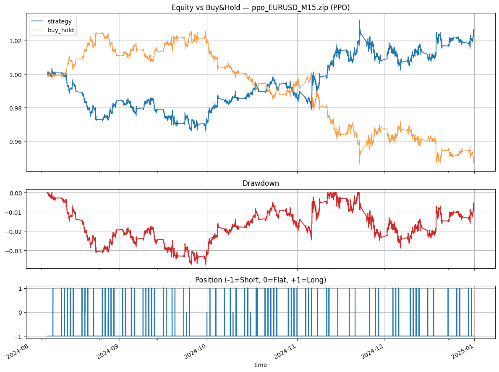
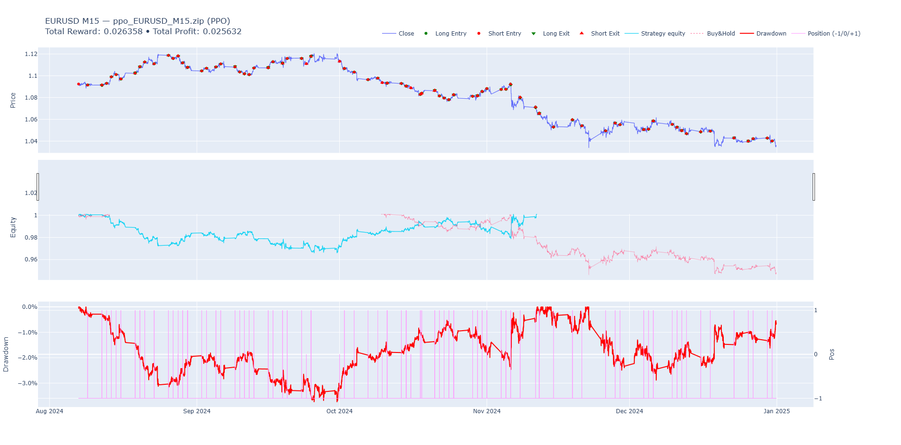

# DRL‑MT5‑Lab

Deep Reinforcement Learning (SB3) + MetaTrader 5 (MT5) for **backtesting** and **live trading**.

This repo keeps research and production concerns separate:
- **Notebooks** for data/feature engineering, training, optimization, backtesting and reports.
- **CLI** for **live inference only** (stable, safe, log‑rich).


---

## Highlights

- **Stable‑Baselines3** agents: PPO, A2C, DQN.
- Clean **live trading CLI** (`live_bot.py`) with multi-algorithm support:
  - **DRY‑RUN** by default (no orders until `--live`).
  - **Market guard**: weekend + stale tick check (configurable).
  - FinRL‑style **verbose logs** + rotating file logs.
  - Feature snapshot (e.g., `close`, `ma_fast`, `ma_slow`, `rsi`).
- Backtest notebook with equity curve; optional QuantStats HTML report.
- Config via `.env` + CLI flags.

---

## Repo layout (typical)

```
.
├─ notebooks/
│  ├─ 1_Data.ipynb
│  ├─ 2_Train.ipynb
│  ├─ 3_Backtest.ipynb
│  └─ 4_Live_Demo.ipynb
│  └─ models/
│    ├─ selected_features.json   # list of columns used by the model
│    └─ ppo_{SYMBOL}_{TF}.zip    # exported Stable‑Baselines3 model
├─ adapters/
│  └─ broker.py                  # MT5 wrapper used by the CLI
│  └─ mt5.py                     # MT5 API functions
├─ features.py                   # add_indicators(...) etc.
├─ live_bot.py                   # ASCII logs + market‑hours guard  ← recommended
├─ utils.py                     
├─ requirements.txt
├─ .env.example
└─ README.md
```

---

## Quickstart

### 1) Environment
```bash
# create and activate your venv/conda, then:
pip install -r requirements.txt
# TA‑Lib on Windows: you may prefer a prebuilt 'ta-lib' wheel or conda-forge.
```

### 2) Create `.env`
Copy `.env.example` → `.env` and fill your MT5 credentials and defaults.

### 3) Train / export a model
Use the notebooks (recommended) to train and save:
- `models/ppo_{SYMBOL}_{TF}.zip`
- `models/selected_features.json` (list of feature column names)

> Alternatively point `--model`/`--features` at your own paths.

### 4) Run the live CLI (default DRY‑RUN)
```bash
# Windows PowerShell
python live_bot.py --symbol EURUSD --timeframe M15

# Place real orders (be careful)
python live_bot.py --symbol EURUSD --timeframe M15 --live
```

The bot will:
1) Pull latest bars via `adapters/broker.fetch_last_n(...)`
2) Build features with `features.add_indicators(...)`
3) Predict action with SB3
4) Close opposite‑side positions if any
5) Place a market order (unless DRY‑RUN)
6) Sleep to the next bar boundary

Logs are streamed to console and to `logs/live_bot.log` (rotating).

---

## CLI options

```bash
python live_bot.py --help
```

Important flags:

- `--symbol EURUSD`           Trading symbol
- `--timeframe M15`           M1/M5/M15/M30/H1/H4/D1 etc.
- `--model PATH`              Model zip (default: models/ppo_{SYMBOL}_{TF}.zip; also checks notebooks/models/)
- `--features PATH`           JSON list of feature columns (default: models/selected_features.json)
- `--volume 0.01`             Lot size
- `--live`                    Actually place orders (otherwise DRY‑RUN)
- `--dry-run`                 Force dry‑run even if `--live` was set
- `--order-comment DRL-Live`  MT5 order comment (shows up in the terminal)
- `--log-file logs/live_bot.log`
- `--skip-market-check`       Bypass weekend/stale‑tick guard
- env: `WEEKEND_TRADING=true` Allow weekend trading (e.g., crypto)

> **Action mapping:** This CLI maps **`0=BUY, 1=HOLD, 2=SELL`** by default (legacy-friendly).  
> If your model uses **`0=BUY, 1=HOLD, 2=SELL`** (common in your legacy notebook), edit `action_to_signals(...)` in the file accordingly.

---

## .env example

See **.env.example** in this repo. Key fields:

```ini
# MT5 connection
MT5_LOGIN=12345678
MT5_PASSWORD=your_password
MT5_SERVER=YourBroker-Server


# Defaults (used if CLI flags are not provided)
TRAINING_SYMBOL=EURUSD
TIMEFRAME=M15
VOLUME=0.01
ORDER_COMMENT=DRL-Live

# Optional Telegram (enable in code where noted)
TELEGRAM_BOT_TOKEN=
TELEGRAM_CHAT_ID=

# Live behavior
WEEKEND_TRADING=false
ALGO=auto
MAGIC=234002
USE_SLTP=false
SL_ATR=2.0
TP_ATR=3.0
```

---

## Backtesting

- Use `notebooks/3_Backtest.ipynb` for a full workflow:
  - Load test split
  - Roll the policy
  - Plot equity curve
  - Compute rough Sharpe (rescaled by bar frequency)
  - (Optional) `QuantStats` report

Minimal snippet you can adapt inside the notebook:
```python
from stable_baselines3 import PPO
import pandas as pd, numpy as np, matplotlib.pyplot as plt

model = PPO.load("models/ppo_EURUSD_M15.zip")

# df_test & feature_cols prepared earlier…
obs, _ = env.reset()
equity = [1.0]
while True:
    action, _ = model.predict(obs, deterministic=True)
    obs, reward, terminated, truncated, info = env.step(int(action))
    equity.append(equity[-1] * (1.0 + reward))
    if terminated or truncated: break

equity = pd.Series(equity, index=df_test.index[:len(equity)])
equity.plot(title="Equity Curve")
plt.show()
```


---

## Broker adapter

All live operations go through `adapters/broker.py`. It should implement:

- `open_session(login, password, server, path) -> bool`
- `close_session() -> None`
- `fetch_last_n(symbol, timeframe, n) -> pd.DataFrame[open,high,low,close,tick_volume,…]`
- `current_positions(symbol) -> pd.DataFrame[ticket,type,volume,profit,magic?,…]`
- `place_market_order(symbol, side, volume, comment, sl=None, tp=None, **kwargs) -> dict`
- (optional) `last_tick(symbol) -> dict` with `bid/ask/time`

> If you want **magic‑number scoping** and **ATR‑based SL/TP**, expose `magic` in positions and accept `sl/tp/deviation` in the order call, then wire the CLI through (tiny patch).

---

## Logging & Windows notes

- Console + rotating file logs (`logs/live_bot.log`).
- On legacy Windows consoles you can also enable UTF‑8:
  - PowerShell: `[Console]::OutputEncoding = [System.Text.Encoding]::UTF8`
  - CMD: `chcp 65001`

---

## Safety checklist

- Start in **DRY‑RUN**. Inspect logs for a few bars.
- Confirm **action mapping** matches your trained model.
- Verify **volume**, **symbol**, **timeframe**, **order comment**.
- Test with a **demo** account first.
- Use **market guard** unless you’re sure about weekend/overnight behavior.

---

## FAQ

**Q: The bot says “market closed” on Saturday**  
A: Expected for most FX pairs. Either wait for Monday or set `WEEKEND_TRADING=true` and `--skip-market-check` (only if your instrument trades on weekends).

**Q: No trades are placed in DRY‑RUN**  
A: That’s by design. Add `--live` to actually send orders.

**Q: My BUY/SELL seem inverted**  
A: Update `action_to_signals(...)` to match your model’s action semantics (see note above).

---

## Backtesting Report

The `3_Backtest.ipynb` notebook evaluates all trained models and generates a comparison of their equity curves, along with detailed individual performance reports.

### Equity Curve Comparison

---
================ ppo_EURUSD_M15.zip | PPO ================
bars            9956.000000
Sharpe             0.896809
Sortino            1.245242
CAGR               0.065507
Calmar             1.755408
MaxDD             -0.037317
WinRate            0.476195
ProfitFactor       1.018795
Exposure           0.995078
Trades           238.000000
AvgHoldBars      847.694255
dtype: float64

---



### Individual Model Reports

- **[View PPO Report](notebooks/reports/quantstats_report_ppo_EURUSD_M15.html)**
- **[View A2C Report](notebooks/reports/quantstats_report_a2c_EURUSD_M15.html)**
- **[View DQN Report](notebooks/reports/quantstats_report_dqn_EURUSD_M15.html)**

> Note: You may need to download the HTML files to view the interactive charts. GitHub provides a static preview.

---

## License

MIT (or your choice).

---

## Disclaimer

This repository is for educational and research purposes only.
Nothing herein constitutes financial, investment, or trading advice.
Trading involves substantial risk. You are solely responsible for any
use of the code and any resulting outcomes.

